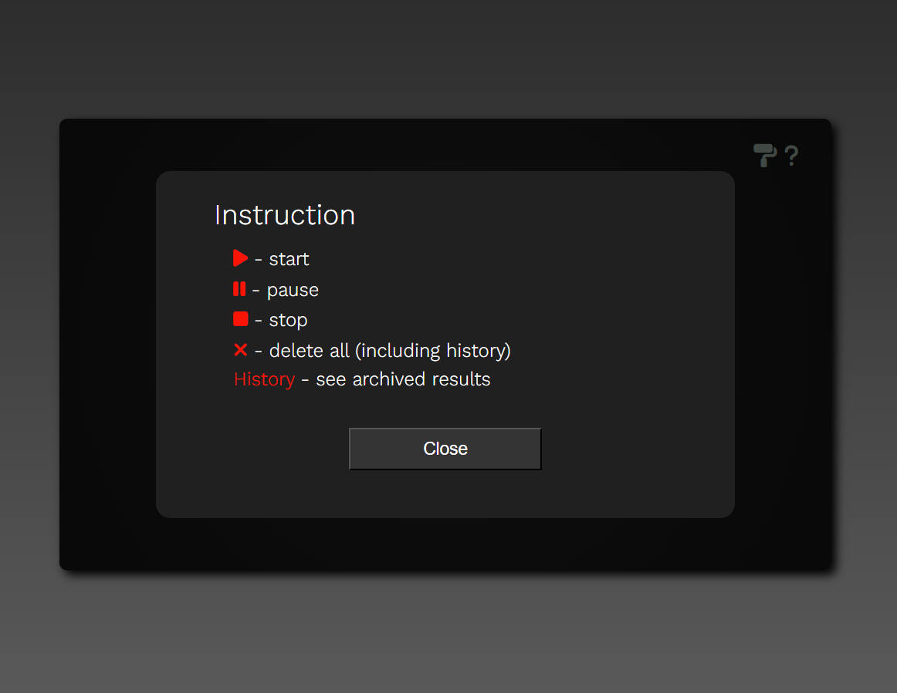

# Stopwatch

# **Form Validator**

#### An elegant stopwatch with a smallan option for customization.

🔎 This app has been deployed and can be visited here: [Form Validator](form-validator-six-rose.vercel.app)

---

## **_Built with_**

1. [Vite](https://vitejs.dev/guide/)
2. [JavaScript](https://developer.mozilla.org/en-US/docs/Web/javascript)
3. [SCSS](https://sass-lang.com/install)

## **_There are only 2 simple installation steps._**

1. **Install Vite Build Tool**

```bash
npm create vite@latest
```

2. **Install SASS preprocessor**

```bash
npm i sass
```

---

### 🖥️ **_Screenshots_**

### Overall view


### The history of results


### After you click the



### After you have chosen a different color


### Available colors


---

### **_Feature Development_**

#### This, as all of the small apps from this series, was created with an intent of gaining understanding in how thigs can be done as well as to develop this project later in TypeScript React.js and Next.js.

### 👉 **_Contibution_**

#### Everyone with a desire to contribute or develop this project is more than welcome to do so.

### 🏷️ **_Credits_**

#### Though some things have been adjusted or coded differently, this project has been inspired by one of the projects created by Mateusz Maj, and it will be only fair to acknowledge that.
